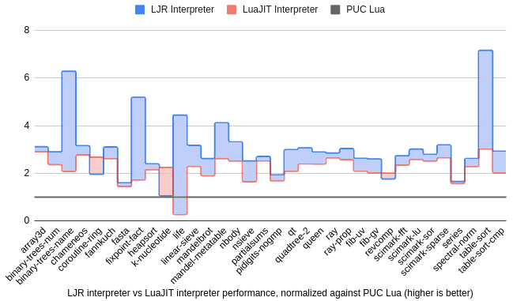

## LuaJIT Remake Project 

*This is a work-in-progress.*

The ultimate goal of this project is to implement a multi-tier method-JIT for Lua.

We employ an unique approach where the interpreter and the JIT tiers are automatically generated from a semantical description of the bytecodes. We believe this will ultimately result in less engineering cost, cleaner and more maintainable code, as well as the *generalizability* to support other languages.
 
Currently we have implemented:
* A feature-complete Lua 5.1 interpreter, which is automatically generated from a [semantical description of the LuaJIT bytecodes](annotated/bytecodes). 
* A completely re-engineered Lua runtime. For example, our implementation of the Lua table uses hidden class, instead of a naive hash table as in Lua/LuaJIT.

### Interpreter performance comparison

On [a variety of benchmarks](luabench), we demonstrate that our interpreter is 34.6% faster than LuaJIT's interpreter, and 185% faster than the official PUC Lua5.1 interpreter[^1]. 

The following figure illustrates our performance vs LuaJIT interpreter, normalized to PUC Lua's performance. Blue shadow indicates benchmarks where we do better than LuaJIT, and red shadow indicates benchmarks where LuaJIT does better than us. 



[^1]: The benchmarks are run on my laptop with Intel i7-12700H CPU and 32GB DDR4 memory. All benchmarks are repeated 5 times. Reported numbers are the geometric average over all benchmarks. 

### The JIT 

The work for implementing the JIT tiers is ongoing...

### Building and Testing

To build the project, make sure you have `docker` and `python3` installed, and run:
```
python3 ljr-build make release
```

Once the build is complete, you should see an executable `luajitr` in the repository root directory. You can use it to run your Lua script, or run `bash run_bench.sh` to run all the benchmarks.  
 
### Caveats

Please note that this is an ongoing project that is still far from production-ready. 

It currently comes with a number of caveats:
1. GC is not implemented. (For a fair benchmark comparison with other Lua implementations, we turned off GC for their implementations as well.)
2. It currently can only run on x86-64 Linux. I need to focus on the functionality implementations first before thinking about portability to other architecture/OS.
3. Some standard library functions, most notably the package library (`require` and `module`), are not implemented. 

### License

[Apache 2.0](https://www.apache.org/licenses/LICENSE-2.0).

